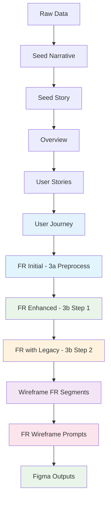

# Project Memory Core (PMC) - System Overview and Document Generation
**Version:** 4.0.0  
**Date:** December 15, 2025  
**Category:** Project Management System

## 1. What is Project Memory Core?

Project Memory Core (PMC) is a sophisticated documentation and project management system designed to maintain consistent, high-quality project documentation through AI-assisted generation. It serves as a foundational framework that enables:

1. **Structured Documentation**: A hierarchical system of interconnected documents that define and track project development
2. **AI-Assisted Generation**: Automated document generation with AI guidance while maintaining quality through example-based templating
3. **Project Memory Management**: Both short-term and long-term project context preservation
4. **Development Guidance**: Clear patterns and practices for project implementation

### Core Components

The PMC system consists of four main components:

1. **Document Generation System**
   - Templates for consistent document structure
   - Example-based generation for quality control
   - Configuration-driven process management
   - Progress tracking and caching

2. **Product Documentation**
   - Hierarchical document structure
   - Clear dependency relationships
   - Version-controlled artifacts
   - Standardized formats

3. **Project Management Tools**
   - Progress tracking
   - Task management
   - Implementation guidance
   - Quality assurance

4. **Advanced Wireframe Generation**
   - Functional requirements to wireframe mapping
   - FR-level wireframe prompt generation
   - Interactive prompt engineering tools
   - Automated mapping and cross-referencing

## 2. Document Generation Process

**Important:** Each script generates prompts that you must execute in an AI agent (like Claude or ChatGPT). The workflow is always:
1. Run the script to generate a customized prompt
2. Copy the prompt from `_run-prompts/`
3. Paste into AI agent with required input files
4. Save AI output to specified location
5. Verify output is ready for next step

### Process Overview by Step

```
Step 00 (Seed Story)
  └─ Script generates final docs directly → No AI execution needed

Step 01 (Overview)
  └─ Script → Prompt → AI Agent → Save output → Verify

Step 02a (User Stories)
  └─ Script → Prompt → AI Agent → Save output → Verify

Step 02b (User Journey)
  └─ Script → Prompt → AI Agent → Save output → Verify

Step 03 (Functional Requirements) - THREE PHASES
  ├─ 3a: Script → Prompt → AI Agent → Save output
  ├─ 3b-#1: Script → Prompt → AI Agent → REPLACE output
  └─ 3b-#2: Script → Prompt → AI Agent → REPLACE output (optional)

Step 04a (FIGMA Wireframes) - ITERATIVE PER SECTION
  ├─ Script → Generates prompts per section (E01, E02, etc.)
  └─ For each section:
      ├─ For each FR prompt:
      │   ├─ Copy FR prompt → VS Code Copilot Agent → Get wireframe spec
      │   ├─ Copy spec → Figma Make AI → Generate visual wireframe
      │   └─ Review & refine wireframe in Figma
      └─ Save refined wireframes

Step 04b (Task Breakdown) - OPTIONAL
  └─ Script → Prompts → AI Agent → Task planning outputs
```

---

### 2.0 Step 00: Seed Story Generation

The seed story generation process uses the script `00-generate-seed-story.js` and follows these steps:

**Input Files:**
- `_seeds/seed-narrative-v1.md` (contains project name and abbreviation)
- `seed-story-config.json` (configuration file)
- `_templates/00-seed-narrative-template.md` (narrative template)
- `_prompt_engineering/product-seed-narrative-prompt-template_v1.md` (prompt template)
- `_examples/00-[project-abbreviation]-seed-narrative.md` (reference example)

**Process:**
1. **Configuration Loading**
   - Reads `seed-story-config.json` for template paths and placeholders
   - Validates file paths and creates cache
   - Manages progress tracking

2. **Document Generation Sequence**
   ```
   Raw Data → Seed Narrative → Seed Story
   ```

**Outputs:**
- `00-{project_abbreviation}-seed-narrative.md`
- `00-{project_abbreviation}-seed-story.md`

**Usage:**
```bash
cd pmc/product/_tools
node 00-generate-seed-story.js
```

**What to Do After Running:**
- No AI execution needed - this script generates final documents directly
- Verify both output files exist in `pmc/product/`
- Review content for accuracy before proceeding to Step 01

---

### 2.1 Step 01: Overview Generation

The overview generation uses `01-generate-overview.js` to create the product overview document:

**Input Files:**
- `00-{project-abbreviation}-seed-story.md` (from step 0)
- `config/prompts-config.json` (configuration file)
- Template files specified in configuration:
  - Overview template (typically `_templates/01-overview-template.md`)
- Example files (specified in configuration):
  - Overview example (typically `_examples/01-{project-abbreviation}-overview.md`)

**Process:**
1. **Overview** (`01-[project-abbreviation]-overview.md`)
   - High-level product description
   - Core value proposition
   - Target audience and pain points
   - Project goals and success criteria
   - Core features and functional scope
   - Product architecture overview
   - Technology stack and dependencies

**Outputs:**
- Prompt file: `_run-prompts/01-product-{abbrev}-overview-prompt-v1.md`

**Usage:**
```bash
cd pmc/product/_tools
node 01-generate-overview.js "Project Name" project-abbreviation
```

**What to Do After Running:**
1. **Locate the generated prompt:**
   - Open `pmc/product/_run-prompts/01-product-{abbrev}-overview-prompt-v1.md`

2. **Execute in AI agent:**
   - Copy the entire prompt content
   - Paste into your AI assistant (Claude/ChatGPT)
   - AI will generate the overview document

3. **Output file location:**
   - The prompt instructs the AI to write directly to: `pmc/product/01-{abbrev}-overview.md`
   - No manual copy/save needed - AI handles file creation

4. **Verify before next step:**
   - File exists at correct location
   - Contains all required sections (overview, goals, features, architecture)
   - Ready to be referenced by Step 02a

---

### 2.2 Step 02a: User Stories Generation

The user stories generation uses `02a-generate-user-story-spec.js` (or can be done manually):

**Input Files:**
- `00-{project-abbreviation}-seed-story.md` (from step 0)
- `01-{project-abbreviation}-overview.md` (from step 1) **← REQUIRED: Must exist before running**
- `config/prompts-config.json` (configuration file)
- Template files specified in configuration:
  - User stories template (typically `_templates/02-user-stories-template.md`)
- Example files (specified in configuration):
  - User stories example (typically `_examples/02-{project-abbreviation}-user-stories.md`)

**Process:**
- **User Stories** (`02-[project-abbreviation]-user-stories.md`)
  - Categorized user stories by impact area
  - Stakeholder narratives and personas
  - Use cases and user journeys
  - Experience goals and acceptance criteria
  - Priority levels and FR mapping placeholders

**Outputs:**
- Prompt file: `_run-prompts/02-product-{abbrev}-user-stories-prompt-v1.md`

**Usage:**
```bash
cd pmc/product/_tools
node 02a-generate-user-story-spec.js "Project Name" project-abbreviation
```

**What to Do After Running:**
1. **Locate the generated prompt:**
   - Open `pmc/product/_run-prompts/02-product-{abbrev}-user-stories-prompt-v1.md`

2. **Execute in AI agent:**
   - Copy the entire prompt content
   - Paste into your AI assistant
   - Ensure AI has access to `01-{abbrev}-overview.md` (referenced in prompt)
   - AI will generate user stories document

3. **Output file location:**
   - The prompt instructs the AI to write directly to: `pmc/product/02-{abbrev}-user-stories.md`
   - No manual copy/save needed - AI handles file creation

4. **Verify before next step:**
   - File exists at correct location
   - Contains categorized user stories by impact area
   - Includes personas, use cases, acceptance criteria
   - Ready to be referenced by Step 02b

**Note:** This script ONLY generates user stories (step 02). Run `01-generate-overview.js` first to create the overview document.

---

### 2.3 Step 02b: User Journey Generation

The user journey generation uses `02b-generate-user-journey_v1.js` to create a comprehensive user journey document:

**Input Files:**
- `00-{project-abbreviation}-seed-story.md` (from step 0)
- `01-{project-abbreviation}-overview.md` (from step 1)
- `02-{project-abbreviation}-user-stories.md` (from step 2)
- `_prompt_engineering/02b-user-journey-prompt_v8.md` (prompt template)
- `_templates/03-functional-requirements-template.md` (format reference)
- `_examples/03-bmo-functional-requirements.md` (quality reference)

**Process:**
1. **Script generates customized prompt**
   - Prompts for input file paths with sensible defaults
   - Validates all files exist
   - Replaces placeholders in template with project-specific values
   
2. **AI-assisted generation**
   - Copy generated prompt from `_run-prompts/`
   - Paste into AI assistant with input files
   - AI generates comprehensive user journey document

3. **User Journey Document** (`02b-[project-abbreviation]-user-journey.md`)
   - Progressive stages from initial contact to final outcome
   - Multiple user personas at different stages
   - Happy path and edge case mapping
   - Granular acceptance criteria (UJ#.#.# format)
   - Entry/exit criteria for each stage

**Outputs:**
- Prompt file: `_run-prompts/02b-product-{abbrev}-user-journey-prompt-v1.md`

**Usage:**
```bash
cd pmc/product/_tools
node 02b-generate-user-journey_v1.js "Project Name" project-abbreviation
```

**What to Do After Running:**
1. **Locate the generated prompt:**
   - Open `pmc/product/_run-prompts/02b-product-{abbrev}-user-journey-prompt-v1.md`

2. **Execute in AI agent:**
   - Copy the entire prompt content
   - Paste into your AI assistant
   - Ensure AI has access to:
     - `01-{abbrev}-overview.md`
     - `02-{abbrev}-user-stories.md`
   - AI will generate comprehensive user journey document

3. **Output file location:**
   - The prompt instructs the AI to write directly to: `pmc/product/02b-{abbrev}-user-journey.md`
   - No manual copy/save needed - AI handles file creation

4. **Verify before next step:**
   - File exists at correct location
   - Contains progressive stages with UJ#.#.# format criteria
   - Includes entry/exit criteria for each stage
   - Ready to be referenced by Step 03

---

### 2.4 Step 03: Functional Requirements Generation (Two-Phase Process)

The functional requirements generation uses `03-generate-functional-requirements.js` with a sophisticated two-step process:

**Input Files:**
- `01-{project-abbreviation}-overview.md` (from step 1)
- `02-{project-abbreviation}-user-stories.md` (from step 2)
- `02b-{project-abbreviation}-user-journey.md` (from step 02b)
- Template files:
  - `_prompt_engineering/3a-preprocess-functional-requirements-prompt_v1.md` (preprocessing)
  - `_prompt_engineering/3b-#1-requirements-enhancement-prompt_v1.md` (PRIMARY enhancement - for ALL projects)
  - `_prompt_engineering/3b-#2-functional-requirements-legacy-code-prompt_v1.md` (OPTIONAL - legacy code references)
- Example file:
  - `_examples/03-{project-abbreviation}-functional-requirements.md`
- Optional: Codebase for legacy integration

**Process:**
#### Step 3a: Preprocessing

1. **Initial Requirements Generation**
   - Converts user stories and user journey to functional requirements
   - Creates basic FR structure with placeholders
   - Maintains traceability to user stories
   - Generates initial acceptance criteria

#### Step 3b: Enhancement Process

1. **Requirements Enhancement** (3b-#1 prompt)
   - Expands and improves functional requirements
   - Adds detailed technical specifications
   - Enhances acceptance criteria
   - Improves clarity and completeness

2. **Legacy Code Integration** (3b-#2 prompt) - Optional
   - Adds references to existing codebase
   - Maps requirements to current implementation
   - Identifies integration points
   - Documents migration strategies

**Key Features:**
- **Two-step process**: Preprocess → Enhance
- **Quality control**: Example-based generation with validation
- **Progress tracking**: Saves state between steps
- **Path caching**: Remembers file locations for efficiency
- **Output management**: Saves prompts to `_run-prompts/`

**Outputs:**
- Phase 1 prompt: `_run-prompts/3a-preprocess-functional-requirements-prompt_v1-output.md`
- Phase 2 prompts:
  - `_run-prompts/3b-#1-functional-requirements-legacy-prompt_v1-output.md`
  - `_run-prompts/3b-#2-functional-requirements-legacy-code-prompt_v1-output.md` (optional)

**Usage:**
```bash
cd pmc/product/_tools
node 03-generate-functional-requirements.js "Project Name" project-abbreviation
```

**What to Do After Running (Three-Phase Execution):**

#### Phase 1: Preprocessing (3a)

1. **Locate the generated prompt:**
   - Open `pmc/product/_run-prompts/3a-preprocess-functional-requirements-prompt_v1-output.md`

2. **Execute in AI agent:**
   - Copy the entire prompt content
   - Paste into your AI assistant
   - AI will clean, deduplicate, and reorder requirements

3. **Output file location:**
   - The prompt instructs the AI to write directly to: `pmc/product/03-{abbrev}-functional-requirements.md`
   - No manual copy/save needed - AI handles file creation

4. **Return to script:**
   - Script will ask: "Ready to continue to enhancement step? (y/n)"
   - Type `y` to proceed to Phase 2

#### Phase 2: Enhancement #1 (3b-#1) - REQUIRED

1. **Locate the generated prompt:**
   - Open `pmc/product/_run-prompts/3b-#1-functional-requirements-legacy-prompt_v1-output.md`

2. **Execute in AI agent:**
   - Copy the entire prompt content
   - Paste into your AI assistant
   - AI will add detailed acceptance criteria and identify gaps

3. **Output file location:**
   - The prompt instructs the AI to modify: `pmc/product/03-{abbrev}-functional-requirements.md`
   - AI will **UPDATE** the existing file with enhanced content
   - No manual copy/save needed - AI handles file modification

#### Phase 3: Enhancement #2 (3b-#2) - OPTIONAL (Only if you have legacy code)

1. **Locate the generated prompt:**
   - Open `pmc/product/_run-prompts/3b-#2-functional-requirements-legacy-code-prompt_v1-output.md`

2. **Execute in AI agent:**
   - Copy the entire prompt content
   - Paste into your AI assistant
   - AI will add legacy code references under each criterion

3. **Output file location:**
   - The prompt instructs the AI to modify: `pmc/product/03-{abbrev}-functional-requirements.md`
   - AI will **UPDATE** the existing file with legacy code references
   - No manual copy/save needed - AI handles file modification

4. **Verify before next step:**
   - File exists at `pmc/product/03-{abbrev}-functional-requirements.md`
   - Contains detailed acceptance criteria
   - All sections are complete (not truncated)
   - Ready for Step 04 wireframe generation

---

### 2.5 Step 04a: FIGMA Wireframe Prompts Generation

---

### 2.5 Step 04a: FIGMA Wireframe Prompts Generation

**Purpose:** Generate Figma-ready wireframe prompts from your functional requirements to create visual wireframes in Figma Make AI.

Uses `04a-generate-FIGMA-wireframe-prompts_v1.js` for Figma-ready prompt generation:

**Input Files:**
- `03-{project-abbreviation}-functional-requirements.md` (from step 03)
- `_prompt_engineering/04-FR-wireframes-FIGMA-prompt_v4.md` (FIGMA template)
- `_mapping/journey-to-wireframe-mapping.json` (journey mapping data)

**Process:**
1. **FR-Level FIGMA Prompt Generation**
   - Reads your enhanced functional requirements
   - Segments by sections (E01, E02, E03, etc.)
   - Extracts individual FR identifiers per section (e.g., FR1.1.0, FR1.2.0)
   - Generates Figma-specific wireframe prompts per FR

2. **FIGMA-Specific Features**
   - **Journey Integration**: Maps FRs to user journey stages
   - **Visual Design Focus**: Prompts optimized for Figma Make AI
   - **Page Count Specifications**: Includes minimum wireframe pages per FR
   - **Line Number Precision**: Calculates exact FR locations for traceability

3. **Template Placeholder System**
   - `[FR_NUMBER_PLACEHOLDER]`: Specific FR identifier (e.g., FR1.1.0)
   - `[STAGE_NAME_PLACEHOLDER]`: Section stage name
   - `[JOURNEY_STAGE_NUMBER]`: Corresponding journey stage
   - `[MINIMUM_PAGE_COUNT_PLACEHOLDER]`: Required wireframe pages
   - `[SECTION_ID_PLACEHOLDER]`: Section identifier (E01, E02, etc.)
   - `[FR_LOCATE_FILE_PATH_PLACEHOLDER]`: Path to prompt file
   - `[FR_LOCATE_LINE_PLACEHOLDER]`: Starting line number for FR
   - `[OUTPUT_FILE_PATH_PLACEHOLDER]`: Figma output destination

**Output Structure:**
```
product/_mapping/fr-maps/
├── prompts/
│   ├── 04a-FIGMA-wireframes-prompt-E01.md     # All Figma prompts for section E01
│   ├── 04a-FIGMA-wireframes-prompt-E02.md     # All Figma prompts for section E02
│   └── 04a-FIGMA-wireframes-prompt-E03.md     # ...and so on
├── 04-{abbrev}-FIGMA-wireframes-output-E01.md # Placeholder for Figma outputs
└── 04-{abbrev}-FIGMA-wireframes-output-E02.md
```

**Usage:**
```bash
cd pmc/product/_tools
node 04a-generate-FIGMA-wireframe-prompts_v1.js "Project Name" project-abbreviation
```

cd pmc/product/_tools
node 04b-generate-FIGMA-wireframe-combined-prompt_v1.js "LoRA Pipeline" pipeline


**What to Do After Running:**

#### Step 1: Review Generated Prompts
- Script generates one prompt file per section (E01, E02, etc.)
- Each file contains multiple FR-specific Figma prompts
- Locate prompts in: `pmc/product/_mapping/fr-maps/prompts/04a-FIGMA-wireframes-prompt-E[XX].md`

#### Step 2: Execute Each Section's Prompts in Sequence

For each section (E01, E02, E03, etc.):

1. **Open the section prompt file:**
   - Example: `pmc/product/_mapping/fr-maps/prompts/04a-FIGMA-wireframes-prompt-E01.md`
   - This file contains ALL FR prompts for that section

2. **Locate each individual FR prompt within the file:**
   - File contains multiple prompts, one per FR (FR1.1.0, FR1.2.0, etc.)
   - Each prompt is clearly marked with FR number and line number reference

3. **Execute FR prompt in VS Code Copilot Agent:**
   - Copy one FR prompt at a time
   - Paste into VS Code Copilot Agent chat
   - Ensure agent has access to your `03-{abbrev}-functional-requirements.md`
   - Agent will generate detailed wireframe specifications for that FR

4. **Save intermediate output:**
   - Copy agent's wireframe specification
   - Keep for next step (Figma Make execution)

#### Step 3: Create Visual Wireframes in Figma Make

1. **Open Figma Make AI:**
   - Access Figma Make's AI wireframe generation feature
   - Ensure you have a Figma project ready

2. **Execute wireframe specification:**
   - Copy the wireframe specification from VS Code agent output
   - Paste into Figma Make AI
   - Figma Make will generate visual wireframes

3. **Review and refine Figma wireframes:**
   - **CRITICAL**: This is where you apply your design expertise
   - Evaluate each wireframe for:
     - **Usability**: Are all user goals achievable?
     - **Interface completeness**: Does it have all needed controls/inputs?
     - **User flow**: Is the navigation logical and intuitive?
     - **Visual hierarchy**: Is information properly organized?
     - **Accessibility**: Are interactions clear and accessible?
   - Make design decisions to improve wireframes:
     - Adjust layout and spacing
     - Refine component placement
     - Add missing interface elements
     - Improve visual consistency
   - **Goal**: Ensure if these wireframes were built into an actual app, they would fully meet the functional requirements

4. **Save final wireframes:**
   - Export/save your refined Figma wireframes
   - Document design decisions
   - Save to: `pmc/product/_mapping/fr-maps/04-{abbrev}-FIGMA-wireframes-output-E[XX].md`

#### Step 4: Repeat for All Sections

- Repeat Steps 2-3 for each section (E02, E03, etc.)
- Maintain consistency across sections
- Cross-reference between related FRs

**Important Notes:**
- **Human judgment is essential**: The AI generates starting points, but YOU make final design decisions
- **Iterative refinement**: Don't accept first wireframe - iterate to perfection
- **Functional validation**: Every wireframe must enable users to complete their goals
- **Document decisions**: Note why you made specific design choices

---

### 2.6 Step 04b: FR Wireframe Task Generator (Alternative/Supplementary)

**Purpose:** Generate detailed task breakdowns from wireframes (alternative workflow for development task planning).

Uses `04b-generate-FR-wireframe-segments_v1.js` for task-oriented wireframe prompts:

**Input Files:**
- `03-{project-abbreviation}-functional-requirements.md` (from step 03)
- `_prompt_engineering/04-FR-with-wireframes-create-tasks_v1.md` (task template)
- `_prompt_engineering/04-FR-with-wireframes-execution-prompts_v1.md` (execution template)

**Process:**
1. **Task-Oriented Wireframe Generation**
   - Generates prompts that focus on development task breakdown
   - Creates both generator prompts AND execution prompts
   - Maps FRs to actionable implementation tasks

**Output Structure:**
```
product/_mapping/fr-maps/
├── prompts/
│   ├── 04-FR-wireframes-prompt-E01.md               # Generator prompts for section E01
│   ├── 04-FR-wireframes-prompt-E02.md               # Generator prompts for section E02
│   └── 04-FR-with-wireframes-execution-prompts_v1.md # Execution instructions
└── 04-bmo-FR-wireframes-output-E[XX].md             # Task outputs
```

**Usage:**
```bash
cd pmc/product/_tools
node 04b-generate-FR-wireframe-segments_v1.js "Project Name" project-abbreviation
```

**When to Use:**
- Use **04a** for visual wireframe design in Figma
- Use **04b** for development task planning and breakdown
- Can use both: 04a for design, then 04b for implementation planning

**What to Do After Running:**
1. Similar process to 04a, but outputs focus on tasks rather than visual design
2. Execute prompts in AI agent to get task breakdowns
3. Use for project planning and sprint organization

## 3. Document Hierarchy and Purpose

### 3.1 Core Documents

1. **Seed Narrative** (`00-[project-abbreviation]-seed-narrative.md`)
   - Takes in unstructured data and returns a structured narrative of the project
   - Initial project vision and stakeholder analysis
   - Pain points and user narratives
   - Core problems and opportunity definition

2. **Seed Story** (`00-[project-abbreviation]-seed-story.md`)
   - Takes in the seed narrative and builds the core story of the project
   - Expanded project definition and success criteria
   - Core capabilities and technical context
   - Implementation scope and constraints

3. **Product Overview** (`01-[project-abbreviation]-overview.md`)
   - Takes in the seed story and builds comprehensive product documentation
   - Product summary and value proposition
   - Target audience and market analysis
   - Project goals and core features
   - Technical architecture and dependencies

4. **User Stories** (`02-[project-abbreviation]-user-stories.md`)
   - Detailed user narratives categorized by impact
   - Experience requirements and interaction flows
   - Success scenarios and acceptance criteria
   - Priority levels and FR mapping preparation

5. **User Journey** (`02b-[project-abbreviation]-user-journey.md`)
   - Complete user experience mapping through progressive stages
   - Granular acceptance criteria (UJ#.#.# format)
   - Entry/exit criteria for each stage
   - Cross-stage dependencies and value progression

6. **Functional Requirements** (`03-[project-abbreviation]-functional-requirements.md`)
   - Technical specifications derived from user stories and journey
   - System requirements and feature definitions
   - Integration requirements and dependencies
   - Enhanced through two-step generation process

7. **Wireframe Specifications** (`04-*-FR-wireframes-E[XX].md`)
   - FR-level wireframe requirements organized by section
   - Section-based requirement organization
   - Figma-ready prompt generation with precise targeting
   - Automated output file management

### 3.2 Document Dependencies



## 4. Tool Reference Guide

### 4.1 Generation Scripts

| Script | Step | Purpose | Input Files | Outputs |
|--------|------|---------|-------------|---------|
| `00-generate-seed-story.js` | 00 | Creates seed narrative and story | `_seeds/seed-narrative-v1.md`, templates, examples | Narrative + Story docs |
| `01-generate-overview.js` | 01 | Overview prompt generation | Seed story, config, templates, examples | Overview prompt |
| `02a-generate-user-story-spec.js` | 02a | User stories prompt generation | Overview (required), config, templates, examples | User Stories prompt |
| `02b-generate-user-journey_v1.js` | 02b | User journey prompt generation | Overview, User Stories, templates | User Journey prompt |
| `03-generate-functional-requirements.js` | 03 | Enhanced FR generation (3a + 3b) | Overview, User Stories, User Journey, templates | FR prompts (3 phases) |
| `04a-generate-FIGMA-wireframe-prompts_v1.js` | 04a | FIGMA wireframe prompt generation | Functional Requirements, FIGMA template | Figma-ready prompts per section |
| `04b-generate-FR-wireframe-segments_v1.js` | 04b | Task-oriented wireframe prompts | Functional Requirements, task templates | Task breakdown prompts |

**Deprecated Scripts** (moved to `archive/`):
- `01-02-generate-product-specs.js` - Split into `01-generate-overview.js` + `02a-generate-user-story-spec.js` for operational consistency
- `04-generate-FR-wireframe-segments_v4.js` - Replaced by `04a-generate-FIGMA-wireframe-prompts_v1.js` (Figma focus) and `04b-generate-FR-wireframe-segments_v1.js` (task focus)
#### Key Configuration Files
- `seed-story-config.json`: Seed generation configuration
- `config/prompts-config.json`: Product spec generation configuration

#### Template Directories
- `_templates/`: Base document templates
- `_examples/`: Reference examples for quality control
- `_prompt_engineering/`: AI prompt templates
- `_seeds/`: Initial project data

#### Cache and Progress
- `cache/`: Path caching for efficiency
- `progress/`: Generation progress tracking
- `_run-prompts/`: Generated prompt outputs (all scripts output here)
- `_mapping/fr-maps/`: Wireframe generation outputs

### 4.3 Advanced Features

#### Path Management
- **Automatic path resolution**: Handles relative and absolute paths
- **Path caching**: Remembers validated paths across sessions
- **Cross-platform compatibility**: Works on Windows and Unix systems

#### Quality Control
- **Example-based generation**: Uses reference examples for consistency
- **Template validation**: Ensures all placeholders are replaced
- **Progress checkpointing**: Allows resumption of interrupted processes

#### Integration Features
- **Codebase review integration**: Optional legacy code analysis
- **Conditional sections**: Dynamic content based on user choices
- **Cross-document referencing**: Maintains traceability between documents

## 5. Best Practices

### 5.1 Document Generation Workflow

1. **Preparation Phase**
   - Ensure all templates and examples are up to date
   - Clear any stale cache files if needed
   - Prepare raw project data in `_seeds/seed-narrative-v1.md`

2. **Generation Sequence**
   ```bash
   cd pmc/product/_tools
   
   # Step 00: Foundation
   node 00-generate-seed-story.js
   # No AI execution needed - generates documents directly
   
   # Step 01: Overview
   node 01-generate-overview.js "Project Name" abbrev
   # → Execute prompt in AI → Save as 01-{abbrev}-overview.md
   
   # Step 02a: User Stories
   node 02a-generate-user-story-spec.js "Project Name" abbrev
   # → Execute prompt in AI → Save as 02-{abbrev}-user-stories.md
   
   # Step 02b: User Journey
   node 02b-generate-user-journey_v1.js "Project Name" abbrev
   # → Execute prompt in AI → Save as 02b-{abbrev}-user-journey.md
   
   # Step 03: Enhanced requirements (THREE prompts)
   node 03-generate-functional-requirements.js "Project Name" abbrev
   # → Execute 3a prompt in AI → Save as 03-{abbrev}-functional-requirements.md
   # → Execute 3b-#1 prompt in AI → REPLACE 03-{abbrev}-functional-requirements.md
   # → Execute 3b-#2 prompt in AI (optional) → REPLACE 03-{abbrev}-functional-requirements.md
   
   # Step 04a: FIGMA wireframe generation
   node 04a-generate-FIGMA-wireframe-prompts_v1.js "Project Name" abbrev
   # → For each section (E01, E02, etc.):
   #    1. Execute each FR prompt in VS Code Copilot Agent
   #    2. Take agent output to Figma Make AI
   #    3. Review and refine Figma wireframes
   #    4. Save refined wireframes
   
   # Step 04b: Task breakdown (optional)
   node 04b-generate-FR-wireframe-segments_v1.js "Project Name" abbrev
   # → Execute prompts for development task planning
   ```

3. **Validation Phase**
   - Review generated documents for completeness
   - Validate cross-references and mappings
   - Test generated prompts for clarity

### 5.2 Quality Assurance

1. **Document Review**
   - Verify all placeholders are replaced
   - Check for consistent terminology
   - Ensure logical flow between documents

2. **Technical Validation**
   - Confirm technical accuracy
   - Validate architectural decisions
   - Review integration requirements

3. **Process Validation**
   - Test prompt effectiveness
   - Verify wireframe generation quality
   - Confirm output file organization

### 5.3 Maintenance and Updates

1. **Template Management**
   - Keep templates synchronized with latest practices
   - Update examples to reflect current standards
   - Version control template changes

2. **Tool Updates**
   - Monitor script performance and reliability
   - Update path handling for new requirements
   - Enhance error handling and user experience

3. **Documentation Maintenance**
   - Keep this overview updated with system changes
   - Document new features and capabilities
   - Maintain troubleshooting guides

## 6. Input File Requirements

### 6.1 Required Input Files by Step

**Step 0:**
- `pmc/product/_seeds/seed-narrative-v1.md` (must contain project name and abbreviation)

**Step 1:**
- `00-{project-abbreviation}-seed-story.md` (output from step 0)
- Configuration and template files as specified in `config/prompts-config.json`

**Step 2:**
- `00-{project-abbreviation}-seed-story.md` (output from step 0)
- `01-{project-abbreviation}-overview.md` (output from step 1)
- Configuration and template files

**Step 02b:**
- `00-{project-abbreviation}-seed-story.md` (output from step 0)
- `01-{project-abbreviation}-overview.md` (output from step 1)
- `02-{project-abbreviation}-user-stories.md` (output from step 2)
- `_prompt_engineering/02b-user-journey-prompt_v8.md`

**Step 3:**
- `01-{project-abbreviation}-overview.md` (output from step 1)
- `02-{project-abbreviation}-user-stories.md` (output from step 2)
- `02b-{project-abbreviation}-user-journey.md` (output from step 02b)
- Preprocessing and enhancement template files

**Step 4:**
- `03-{project-abbreviation}-functional-requirements.md` (enhanced output from step 3)
- `_prompt_engineering/04-FR-wireframes-prompt_v4.md` (v4 template)

### 6.2 File Format Requirements

All input markdown files should follow these standards:
- UTF-8 encoding
- Consistent heading hierarchy
- Proper section numbering for FR files
- Clear FR identifiers (e.g., FR1.1.0, FR1.2.0)

## 7. Troubleshooting Guide

### Common Issues

1. **Path Resolution Errors**
   - Clear cache files in relevant directories
   - Verify file paths exist before generation
   - Check for proper project structure

2. **Template Not Found**
   - Ensure template files exist in expected locations
   - Verify template names match configuration
   - Check for proper file permissions

3. **Generation Interruption**
   - Resume from progress files
   - Clear problematic cache entries
   - Restart individual steps as needed

4. **User Journey File Not Found (Step 3)**
   - Ensure you ran step 02b and saved the AI output
   - Verify file is named `02b-{abbrev}-user-journey.md` (not `03.5-` or `02.5-`)
   - Check the file exists in `pmc/product/`

### Error Recovery

1. **Cache Management**
   ```bash
   # Clear all cache files
   rm -rf pmc/product/_tools/cache/*
   
   # Clear specific project cache
   rm pmc/product/_tools/cache/*{project-abbrev}*
   ```

2. **Progress Reset**
   ```bash
   # Reset progress for specific project
   rm pmc/product/_tools/progress/*{project-abbrev}*
   ```

### Performance Optimization

1. **Use cached paths when available**
2. **Run steps in sequence for dependency consistency**
3. **Monitor output file sizes for reasonable limits**
4. **Regular cleanup of temporary files**

## 8. Output Directory Structure

All generated prompts are now saved to a unified location:

```
pmc/product/
├── _run-prompts/                                      # All generated prompts
│   ├── 01-product-{abbrev}-overview-prompt-v1.md     # Step 01 output
│   ├── 02-product-{abbrev}-user-stories-prompt-v1.md # Step 02a output
│   ├── 02b-product-{abbrev}-user-journey-prompt-v1.md # Step 02b output
│   ├── 3a-preprocess-functional-requirements-prompt_v1-output.md # Step 03 Phase 1
│   ├── 3b-#1-functional-requirements-legacy-prompt_v1-output.md  # Step 03 Phase 2
│   └── 3b-#2-functional-requirements-legacy-code-prompt_v1-output.md # Step 03 Phase 3 (optional)
├── 00-{abbrev}-seed-narrative.md                      # Step 00 output
├── 00-{abbrev}-seed-story.md                          # Step 00 output
├── 01-{abbrev}-overview.md                            # Step 01 final (from AI)
├── 02-{abbrev}-user-stories.md                        # Step 02a final (from AI)
├── 02b-{abbrev}-user-journey.md                       # Step 02b final (from AI)
├── 03-{abbrev}-functional-requirements.md             # Step 03 final (from AI)
└── _mapping/fr-maps/                                  # Step 04 outputs
    ├── prompts/
    │   ├── 04a-FIGMA-wireframes-prompt-E01.md        # Step 04a prompts
    │   ├── 04a-FIGMA-wireframes-prompt-E02.md
    │   ├── 04-FR-wireframes-prompt-E01.md            # Step 04b prompts (optional)
    │   └── 04-FR-wireframes-prompt-E02.md
    ├── 04-{abbrev}-FIGMA-wireframes-output-E01.md    # Final Figma wireframes
    └── 04-{abbrev}-FIGMA-wireframes-output-E02.md
```

## 9. Future Enhancements

### Planned Features
- **Automated testing integration**: Link with testing frameworks
- **Code generation**: Automatic scaffolding from requirements
- **CI/CD integration**: Automated documentation updates
- **Advanced analytics**: Generation quality metrics

### Extension Points
- **Custom template systems**: Support for domain-specific templates
- **Plugin architecture**: Extensible tool system
- **API integration**: External tool connectivity
- **Collaborative features**: Multi-user document generation

---

**For questions and support**, refer to the project documentation or contact the development team.
